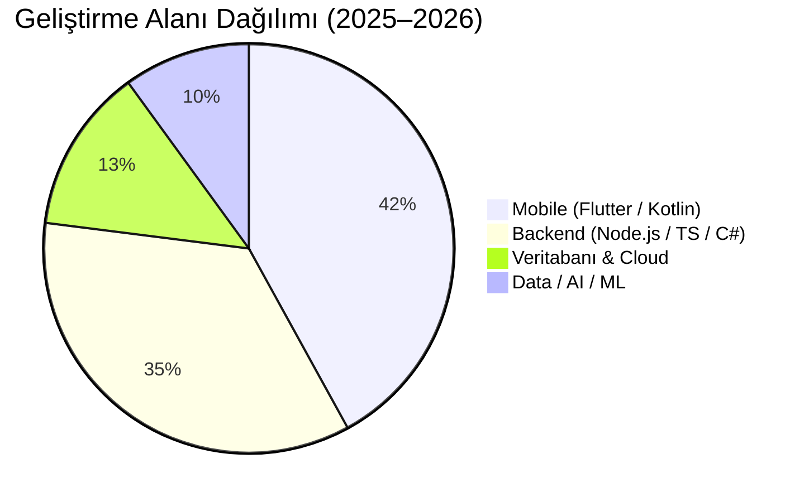
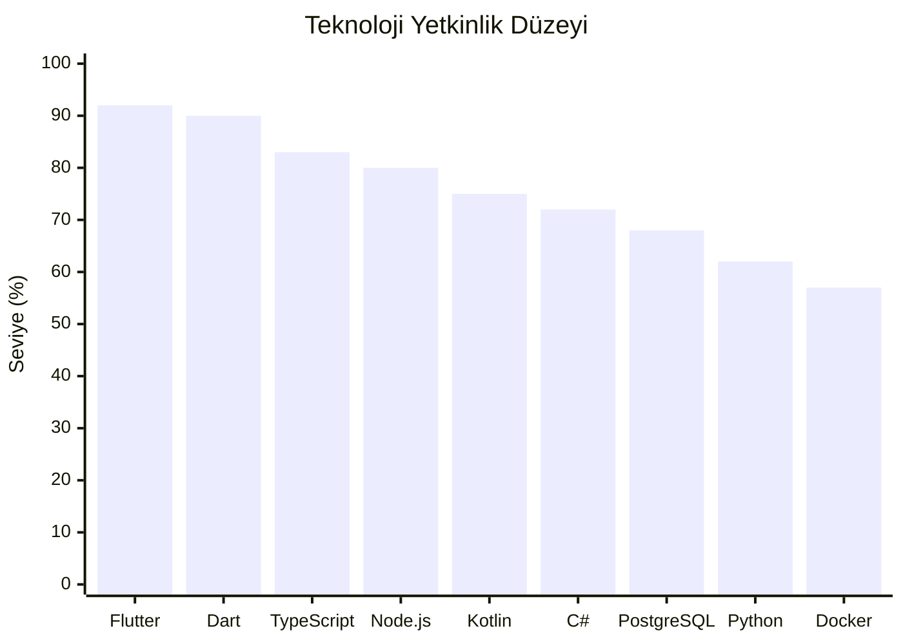

---

## 👤 Hakkımda

Mobil (Flutter, Kotlin), backend (Node.js, TypeScript, C#) ve veri/ML alanlarında ürün geliştiriyorum.
**Go Gamer**'da Co-Founder & Head of Programming olarak çalışıyor; temiz kod, test edilebilir mimari ve kullanıcı odaklı ürünlere odaklanıyorum.

- 🔭 Şu an: **Kuran Super App** — Flutter + Node.js/TypeScript + PostgreSQL
- 🌱 Odak: Mobile-first architecture · Type-safe backends · AI integration
- 🏢 Şirket: [Go Gamer](https://gogamer.com.tr/) · İzmir
- 🌐 Web: [berkeceliker.dev](https://www.berkeceliker.dev)

---

## 🛠️ Tech Stack

**📱 Mobile**

  

**⚙️ Backend & Runtime**

  

**🗄️ Veritabanı & Cloud**

  

**🤖 Data & AI / ML**

  

**🔧 Araçlar & Diğer**

  

---

## 📊 GitHub İstatistikleri

---

## 📈 Katkı Aktivitesi

---

## 🏆 GitHub Trophies

---

## 📉 Teknoloji Odak Dağılımı

---

## 📂 Öne Çıkan Projeler

| Proje | Açıklama | Stack |
|-------|----------|-------|
| [**Kuran Super App**](https://github.com/anilonayy/kuransuperapp) | Quran okuma, namaz vakitleri, zikir, kıble | Flutter · TypeScript · PostgreSQL |
| [**EvolutionHUB**](https://github.com/mustafaceliker/EvolutionHUB-project) | Android alışkanlık takipçisi ve hedef yöneticisi | Kotlin · Android |
| [**FoodDeliveryAutomation**](https://github.com/mustafaceliker/FoodDeliveryAutomation) | Admin ve kullanıcı rollü yemek sipariş sistemi | C# · .NET |
| [**EvHarmoni PMP**](https://github.com/mustafaceliker/EvHarmoni-AkilliEvSistemleri-PMP) | Akıllı ev proje yönetim planı | Dokümantasyon · PMP |
| [**LimanMYS 2.0**](https://github.com/mustafaceliker/LimanMYS2.0) | Liman MYS kurulum ve sıfırlama otomasyonu | Shell · Linux |

---

## 📬 İletişim

---

