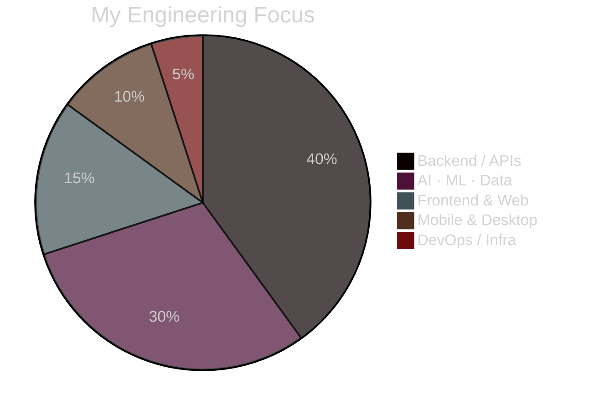
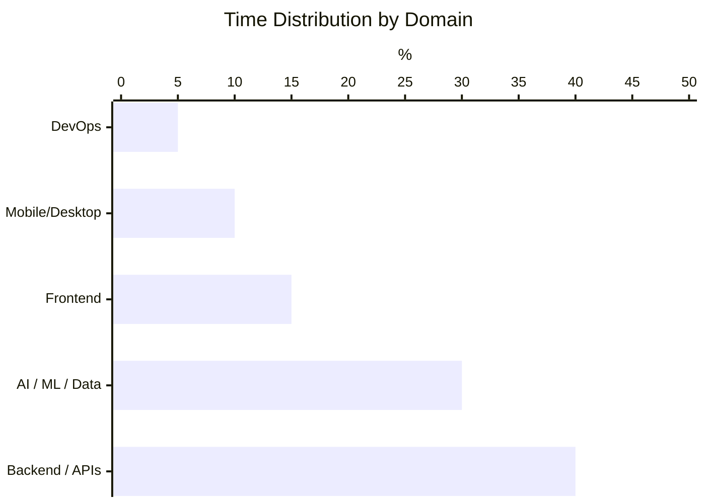

  

---

## GitHub Stats

  
  

  

---

## Contribution Activity

  

---

## About Me

I'm a backend-focused engineer and co-founder building production systems at the intersection of **APIs, AI/ML pipelines, and data engineering**.
Currently also working on web, mobile (Flutter/Kotlin), and desktop (Electron/Tauri) products.

- 🏢 Co-Founder & Head of Programming — **[Go Gamer](https://gogamer.com.tr/)** · İzmir, TR
- 🌐 Portfolio — **[berkeceliker.dev](https://www.berkeceliker.dev)**
- 🔭 Primary focus: backend systems · AI/ML integration · data pipelines
- 🛠️ Also active in: React/Next.js · Flutter · Electron/Tauri

---

## Tech Stack

**⚙️ Backend & APIs**

  

**🤖 AI / ML / Data**

  

**🗄️ Databases & Cloud**

  

**🌐 Frontend & Web**

  

**📱 Mobile & Desktop**

  

**🔧 DevOps & Tools**

  

---

## Technology Focus

---

## Where I Spend My Time

---

## Featured Projects

| Project | Description | Stack |
|:--------|:------------|:------|
| **[GoGamer Store App](https://gogamer.com.tr/)** *(private)* | Store management system — inventory, sales, service, analytics | TypeScript · Electron · React · PostgreSQL |
| **[Kuran Super App](https://github.com/anilonayy/kuransuperapp)** | Quran reader, prayer times, dhikr & qibla compass | Flutter · TypeScript · PostgreSQL |
| **[EvolutionHUB](https://github.com/mustafaceliker/EvolutionHUB-project)** | Android habit tracker and goal manager | Kotlin · Android |
| **[FoodDeliveryAutomation](https://github.com/mustafaceliker/FoodDeliveryAutomation)** | Food order platform with admin & user roles | C# · .NET |
| **[LimanMYS 2.0](https://github.com/mustafaceliker/LimanMYS2.0)** | Server management automation & reset scripts | Shell · Linux |

---

## Starred Repos

  
  
  

---

## Connect

  

